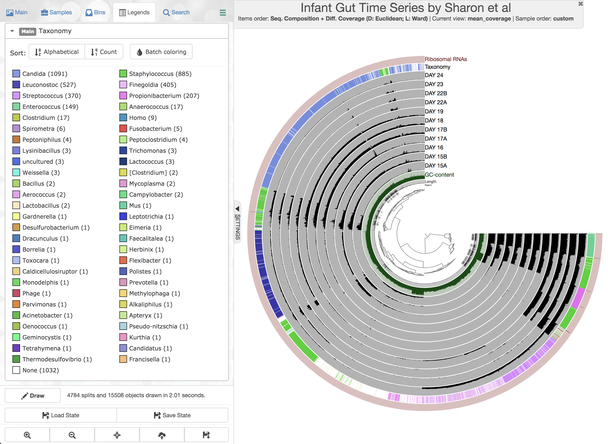
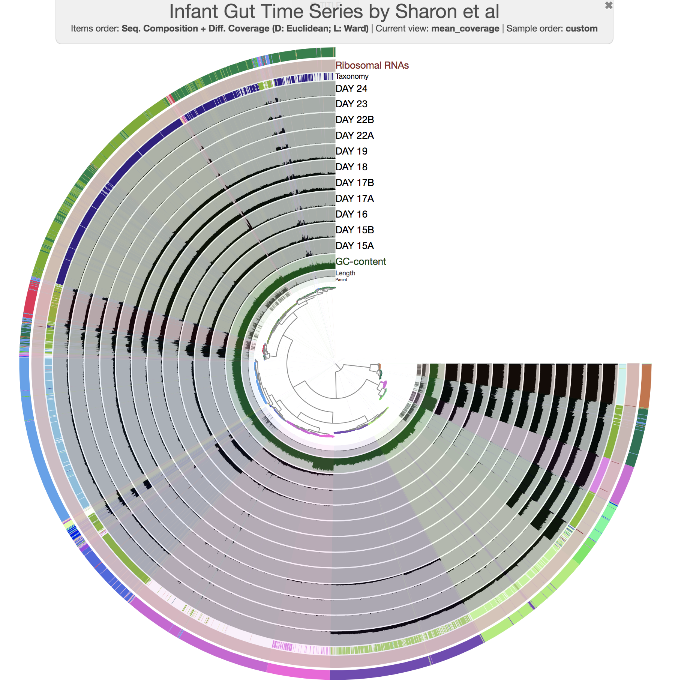
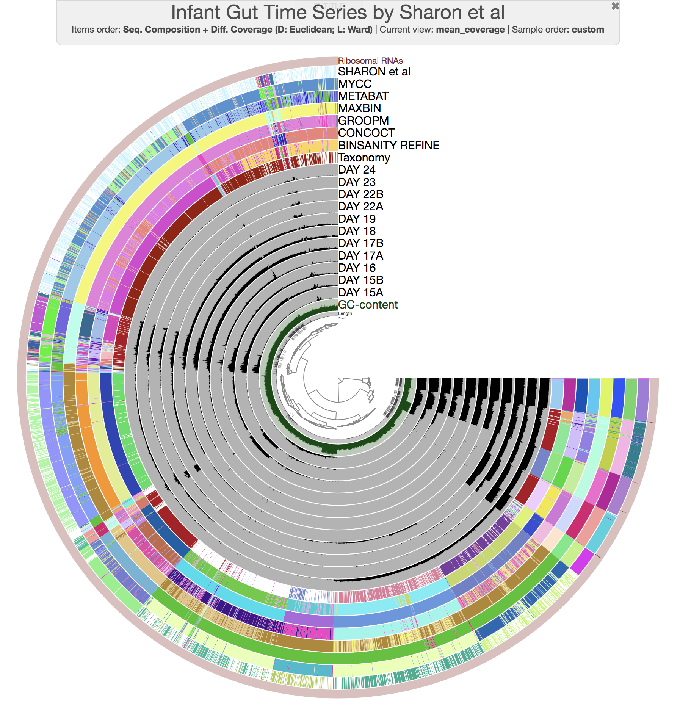
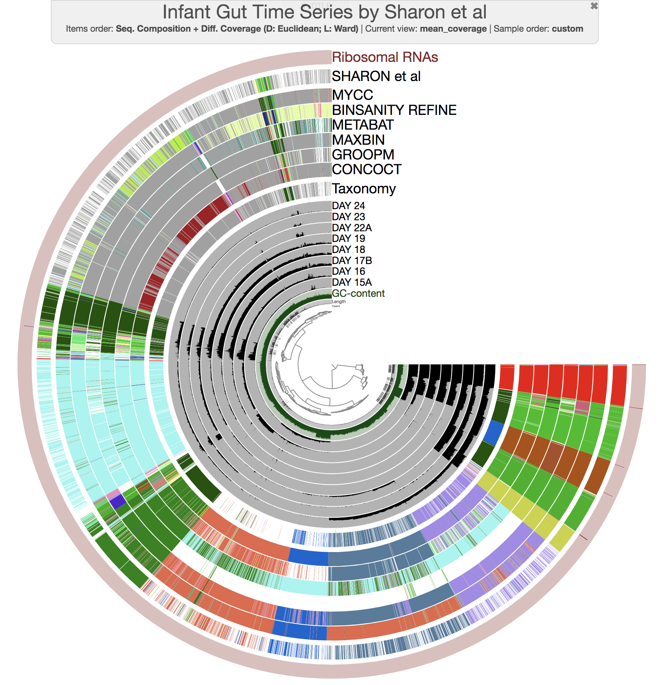
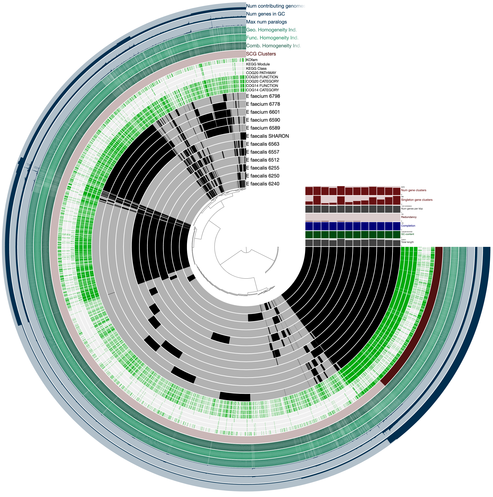

{:.notice}
This tutorial is tailored for anvi'o `v2.0.1`. If you do not have this version available to you, certain things may not work the way they should.

The purpose of this tutorial is to demonstrate some of the anvi'o capabilities using the Infant Gut dataset, which was generated, analyzed, and published by [Sharon et al. (2013)](http://www.ncbi.nlm.nih.gov/pubmed/22936250), and was re-analyzed in the [anvi'o methods paper](https://peerj.com/articles/1319/). If you are reading this tutorial, you are assumed to have access to the infant gut data pack, which contains some raw and intermediate metagenomic data from the infant gut dataset.

While this tutorial will take you through a simple analysis of a real dataset, you can access to a more comprehensive, yet more abstract tutorial [here]().



## BAM files and contigs FASTA for the Infant Gut data

In the directory `00_BAM_FILES_AND_CONTIGS` you will find the the the co-assembly of the time series data, `contigs.fa`, and an indexed BAM file for each sampling day. These BAM files were generated by mapping metagenomic short reads from each sample to `contigs.fa`.

{:.notice}
Dear ECOGEO people, you will be missing this directory in your data pack due to size considerations for the virtual machine.

Anvi'o metagenomic workflow [starts with BAM files and a FASTA file](#preparation) for your contigs. There are many ways to get your contigs and BAM files for your metagenomes. But we have started implementing a tutorial that describes the workflow _we_ use to generate these files regularly: "[A tutorial on assembly-based metagenomics]({{ site.url }}/tutorials/assembly-based-metagenomics/)". Please feel free to take a look at that one, as well.

## The merged profile

The directory `01_ANVIO_MERGED_PROFILE` contains the anvi'o contigs database that is generated from `contigs.fa`, and the anvi'o merged profile, which is generated by merging individual anvi'o profiles for each of the BAM file in `00_BAM_FILES_AND_CONTIG`.

{:.notice}
Want to learn more? Here are some direct links: [generating an anvi'o contigs database](#creating-an-anvio-contigs-database), [profiling BAM files](#profiling-bam-files), and [merging anvi'o profiles](#working-with-anvio-profiles)

If you go into that directory,


 $ cd 01_ANVIO_MERGED_PROFILE/


and execute the `anvi-interactive` command on these files,


 $ anvi-interactive -p PROFILE.db -c CONTIGS.db 


The anvi'o interactive interface should pop up with this display:

{:.center-img .width-50}

Once the interactive interface is up and running, you can start binning:

{:.center-img .width-50}

When you are tired of the interactive interface, you can go back to the terminal and press `CTRL + C` to kill the server.

## Importing taxonomy

[Centrifuge](https://github.com/infphilo/centrifuge) is [one of the options](#centrifuge-output) to [import taxonomic annotations]() into an anvi'o contigs database. Files for the infant gut data are already in the directory `02_CENTRIFUGE_FILES`.

If you import these files into the contigs database the following way,


 $ anvi-import-taxonomy -c CONTIGS.db -i ../02_CENTRIFUGE_FILES/*.tsv -p centrifuge 


And run the interactive again,


 $ anvi-interactive -p PROFILE.db -c CONTIGS.db 


You will see an additional layer with taxonomy:

{:.notice}
In the Layers tab find the `Taxonomy` layer, set its height to `200`, and click `Draw` again. Then click `Save State` button, and overwrite the `default` state. This will make sure anvi'o remembers to make the height of that layer 200px the next time you run the interactive interface!

{:.center-img .width-50}

## Binning

### External binning results

The directory `03_EXTERNAL_BINNING_RESULTS` contains number of files describe the binning of contigs in the infant gut data based on various binning approaches:

* [GROOPM.txt](files/GROOPM.txt)
* [METABAT.txt](files/METABAT.txt)
* [MAXBIN.txt](files/MAXBIN.txt)
* [CONCOCT.txt](files/CONCOCT.txt)
* [SHARON_et_al.txt](files/SHARON_et_al.txt)

The first three files are courtesy of Elaina Graham, who used [GroopM](http://www.ncbi.nlm.nih.gov/pmc/articles/PMC4183954/) (v0.3.5), [MetaBat](https://peerj.com/articles/1165/) (v0.26.3), and [MaxBin](https://microbiomejournal.biomedcentral.com/articles/10.1186/2049-2618-2-26) (v2.1.1) to bin contigs using BAM files and the contigs FASTA in `01_ANVIO_MERGED_PROFILE`. For future references, here are the parameters Elaina used for each approach:


 # GroopM v0.3.5 (followed the general workflow on their manual)
 $ groopm parse groopm.db contigs.fa [list of bam files]
 $ groopm core groopm.db -c 1000 -s 10 -b 1000000
 $ groopm recruit groopm.db -c 500 -s 200
 $ groopm extract groopm.db contigs.fa 

 # MetaBat v0.26.3 (used jgi_summarize_bam_contig_depths to get a depth file from BAM files).
 $ metabat -i contigs.fa -a depth.txt -o bin

 # MaxBin v2.1.1
 $ run_MaxBin.pl -contig contigs.fa -out maxbin_IGM -abund_list [list of all coverage files in associated format]


[CONCOCT](http://www.nature.com/nmeth/journal/v11/n11/full/nmeth.3103.html) results come from the CONCOCT module embedded within anvi'o. 

Finally, I generated Sharon et al. results by BLAST searching sequences in bins identified by the authors of the study (see [http://ggkbase.berkeley.edu/carrol](http://ggkbase.berkeley.edu/carrol)) to our contigs to have matching names.

OK. Moving on.

### Comparing binning results

You can import a file that describes the results of an external binning effort into your profile database, and see how they group contigs. For instance, let's import the CONCOCT collection:


 $ anvi-import-collection -c CONTIGS.db -p PROFILE.db -C CONCOCT --contigs-mode ../03_EXTERNAL_BINNING_RESULTS/CONCOCT.txt


And run the interactive again,


 $ anvi-interactive -p PROFILE.db -c CONTIGS.db 


Once the display is ready, click `Bins > Load bin collection > CONCOCT > Load`.

{:.center-img .width-50}

So far so good.

But since we have all these results from different binning approaches, it clearly would have been interesting to compare them to each other (because [benchmarking stuff]() is often very insightful, especially when everything about metagenomics is very complex).

To compare binning results, we could import each external binning result into the profile database the way we imported CONCOCT. But unfortunately at any given time there could only be one bin collection can be displayed in the interface. Fortunately there are other things we can do. For instance, as a workaround we can merge all binning results into a single file, and use that file as an 'additional data file'.

I implemented a little program, [`anvi-script-merge-collections`](files/anvi-script-merge-collections), to merge multiple collections into a single TAB-delimited file. If you download it,


 $ wget http://merenlab.org/tutorials/infant-gut/files/anvi-script-merge-collections


And use it the following way,


 $ python anvi-script-merge-collections -c CONTIGS.db -i ../03_EXTERNAL_BINNING_RESULTS/*.txt -o collections.tsv


You can run the interactive interface to display all collections of bins stored in `collections.tsv` as additional layers,


 $ anvi-interactive -p PROFILE.db -c CONTIGS.db -A collections.tsv


And you would get a display similar to this (after setting the height of each additional layer to 200px):

{:.center-img .width-50}

To make thinks a little more visually related, I created an anvi'o states file, `states.json`, and wrote a program, `anvi-import-state`, to import it into your profile database. If you download these files and run them the following way, 


 $ wget http://merenlab.org/tutorials/infant-gut/files/anvi-import-state
 $ wget http://merenlab.org/tutorials/infant-gut/files/state.json
 $ python anvi-import-state --state state.json --name default -p PROFILE.db


And run the interactive interface again,


 $ anvi-interactive -p PROFILE.db -c CONTIGS.db -A collections.tsv


This time you will get this display:

{:.center-img .width-50}

Let's also import the collection we published in the [anvi'o methods paper](https://peerj.com/articles/1319/) with the proper colors:


 $ wget http://merenlab.org/tutorials/infant-gut/files/merens.txt
 $ wget http://merenlab.org/tutorials/infant-gut/files/merens-info.txt
 $ anvi-import-collection merens.txt -p PROFILE.db -c CONTIGS.db -C merens --bins-info merens-info.txt


Now you can rerun the interactive interface, and click `Bins > Load bin collection > merens > Load` to display our collection in comparison:

{:.center-img .width-50}

Much better!

All was for this moment: Now we can discuss about the efficacy of different approaches, and how while everyone is doing a pretty decent job with well-covered genomes, most approaches fall apart resolving low-abundance genomes.

As a reminder, you can in fact investigate the taxonomy of contigs by BLASTing them against NCBI's collection using the right-click menu to have a second opinion about what do public databases think they are:

{:.center-img .width-50}

## Profiling single-nucleotide variants

To be written. The relevant directory is `04_VARIABILITY_ANALYSIS`.

## Pangenomic analysis of _E. facealis_ bin

To be written. The relevant directory is `05_PANGENOMICS`.


 $ cd ../05_PANGENOMICS/
 $ sed -i 's/03_ANVIO_MERGED_PROFILE/01_ANVIO_MERGED_PROFILE/g' internal-genomes.txt



 $ anvi-pan-genome -i internal-genomes.txt -e external-genomes.txt -o enterococcus_pan_genome -T 4



 $ cd enterococcus_pan_genome/enterococcus_pan_genome/
 $ anvi-interactive -t tree.txt -d view_data.txt -s samples.db -A additional_view_data.txt --manual -p profile.db --title "Enterococcus Pan"


{:.center-img .width-50}

Kill the server.


 $ wget http://merenlab.org/tutorials/infant-gut/files/pan-state.json 
 $ anvi-import-state -p profile.db --state pan-state.json --name default
 $ anvi-interactive -t tree.txt -d view_data.txt -s samples.db -A additional_view_data.txt --manual -p profile.db --title "Enterococcus Pan"


{:.center-img .width-50}

